# AdvancedDataAnalysis
## 最小二乗回帰
ガウスカーネルモデルに対するl2-正則化を用いた最小二乗回帰を実装する．
正則化パラメータとガウス幅を交差確認法によって決定する．[（実装）](src/Lec2/cross_validation.py)

### 結果

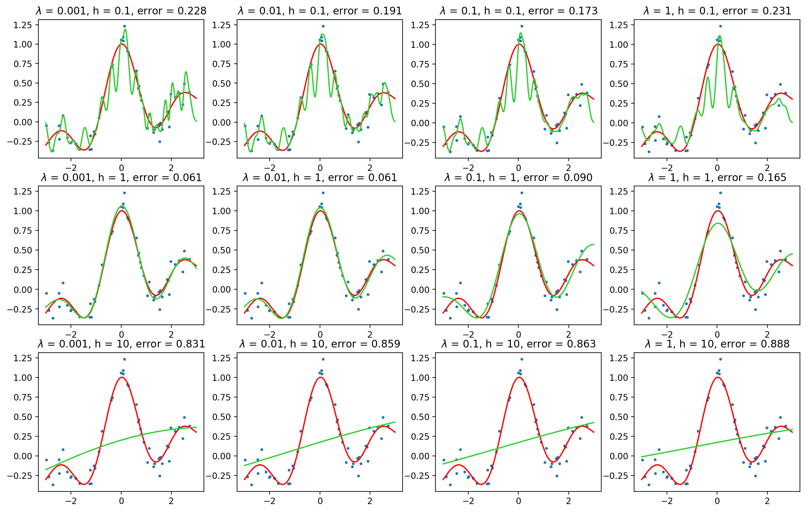

これにより

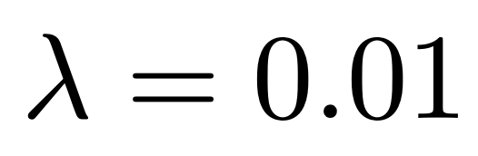

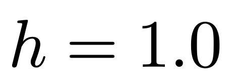

と決めた．

## 適応正則化学習
二乗ヒンジ損失に基づく適応正則化分類を線形モデル

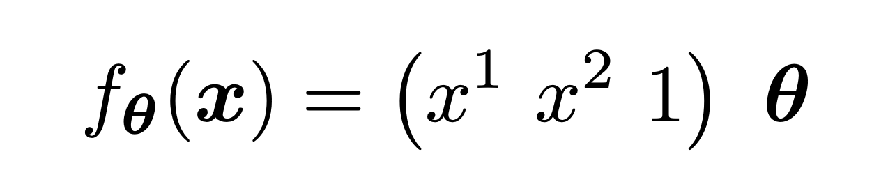

に対して適用する．[（実装）](src/Lec8/adaptive.py)

### 結果

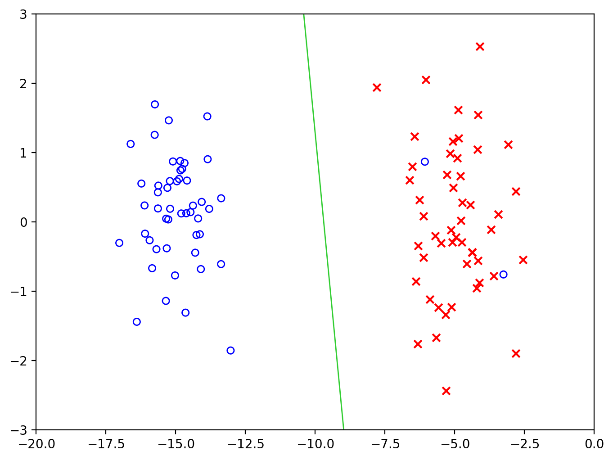

異常値に対してロバストな結果が得られている．

## 半教師付き学習
ガウスカーネルモデルに対してラプラス正則化最小二乗分類を実装する．

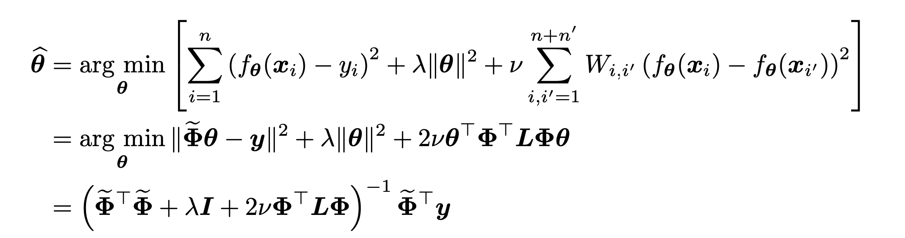

によってパラメータを決める．[（実装）](src/Lec9/lrls.py)

### 結果

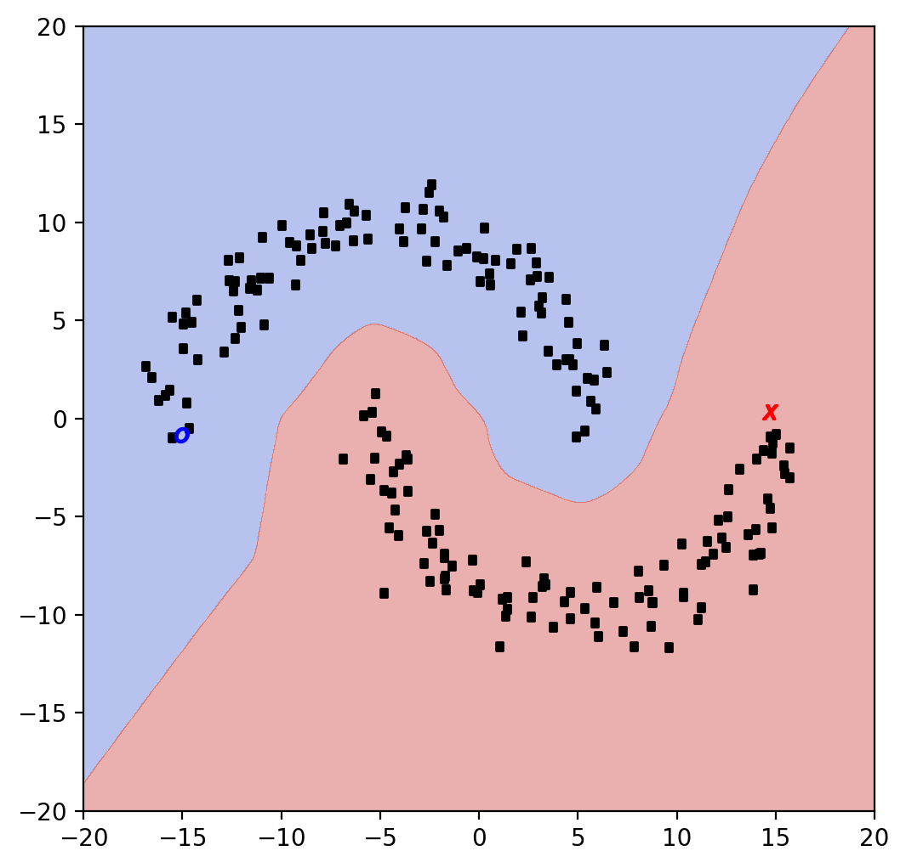

データのなす領域に沿った識別面が得られている．

## 転移学習
線形モデルに対してクラス比重み付き最小二乗法を実装する．訓練データとテストデータでクラスを構成する点の比率が異なるデータを用いた．[（実装）](src/Lec9/cwls.py)

### 結果
左が訓練データ，右がテストデータ．

##### 重みなしの最小二乗法による分類結果

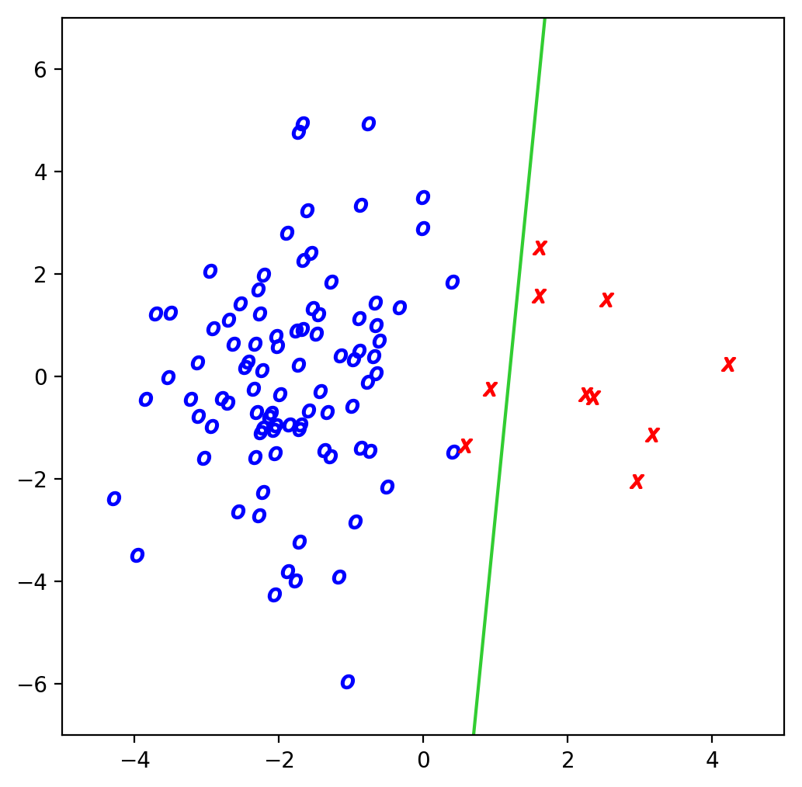
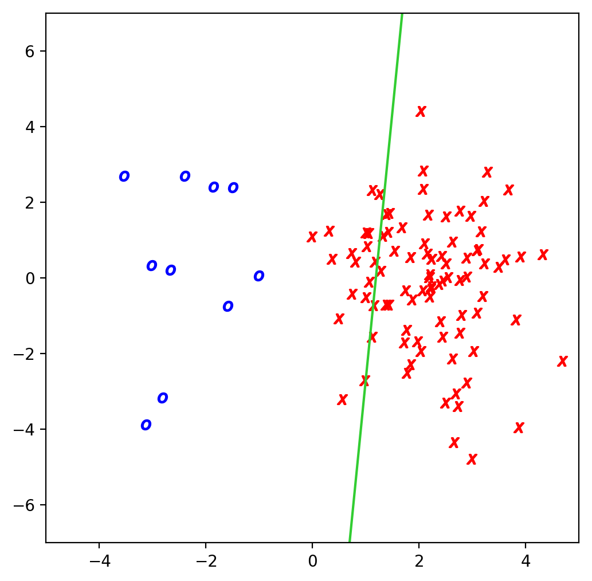

##### 重み付き最小二乗法による分類結果

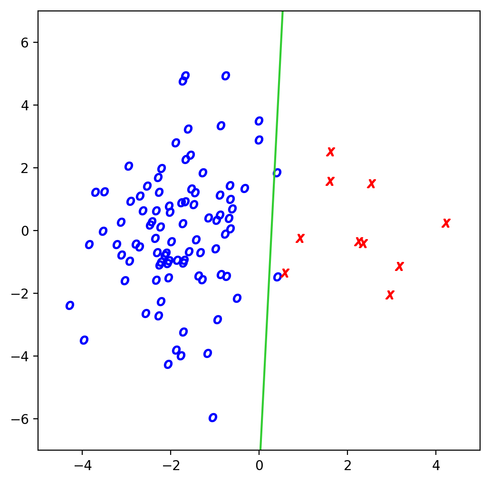
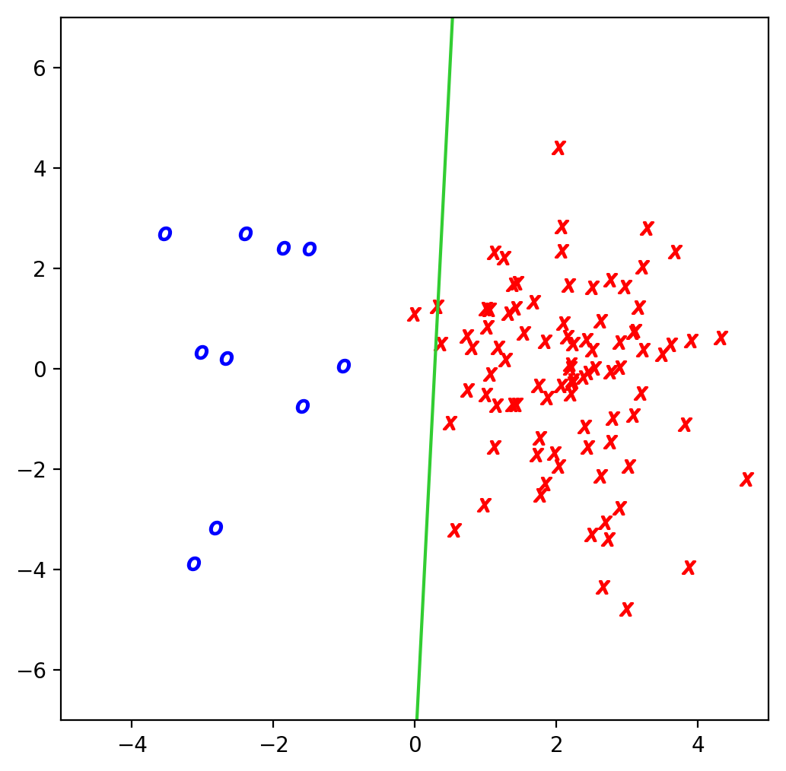

重みなしのときはテストデータが正しく分類できていなかったが，重み付き最小二乗法によって，テストデータも正しく分類する識別面が得られていることが確認できる．

## 局所性保存射影による次元削減
類似度行列を

として実装した．[（実装）](src/Lec10/lpp.py)

### 結果

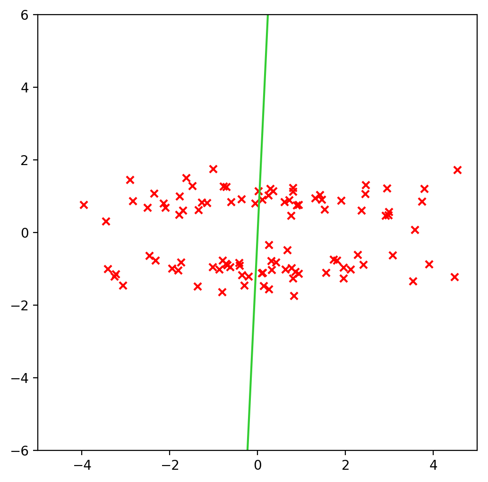

データのクラスタ構造を保持したまま射影することができている．

## フィッシャー判別分析
教師あり次元削減のひとつであるフィッシャー判別分析を実装する，異なるクラスの標本を分けるように次元削減を行うために，クラス内散布を小さく，クラス間分布を大きくするように次元削減を行う．[（実装）](src/Lec11/fda.py)

### 結果

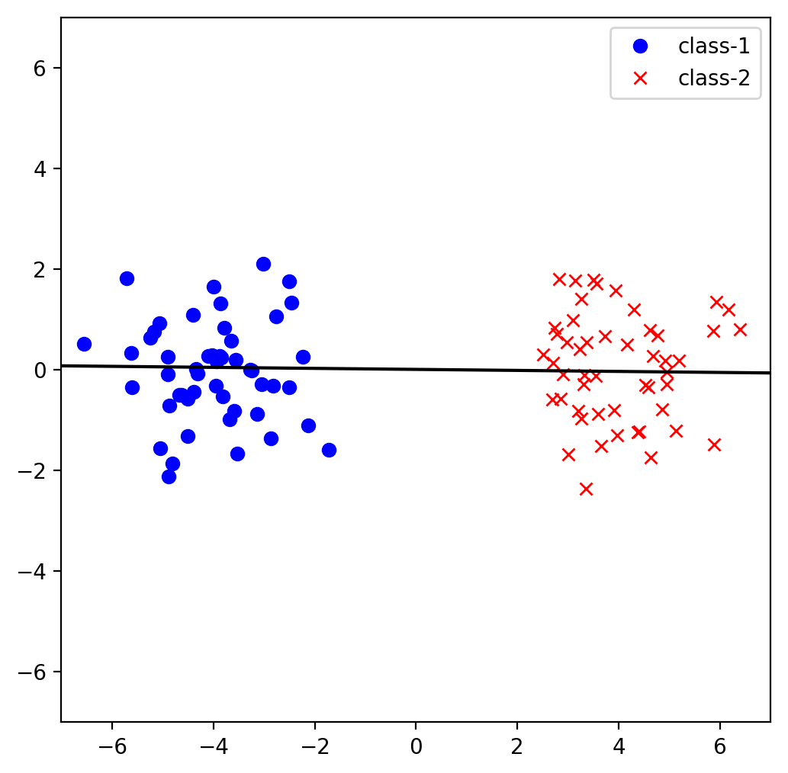

クラス1, 2 を分けるように射影できていることがわかる．

## ラプラス固有写像
データの分布が曲がっているときは，線形次元削減ではうまく構造を抽出できない．そこで，
データを特徴空間に非線形変換し，その特徴空間上で線形次元削減を行う．ここでは，局所性保存射影をカーネル化したラプラス固有写像を実装する．[（実装）](src/Lec12/lapeig.py)

類似度行列には最近傍類似度

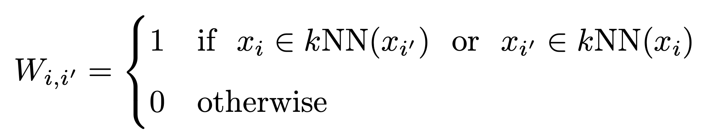

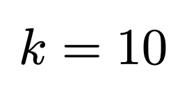

を用いた．

### 結果

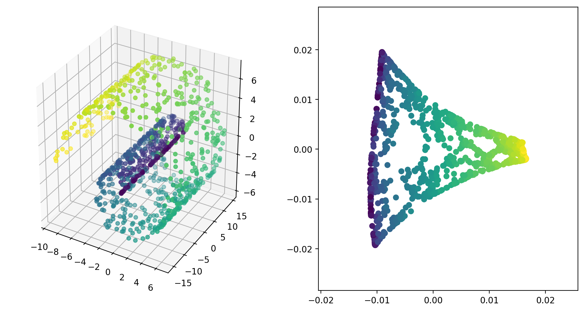

元の三次元データが持つ構造を残したまま，二次元のデータに次元削減できている．
また，類似度行列がスパースであるため，効率的に固有値問題を解くことができた．
